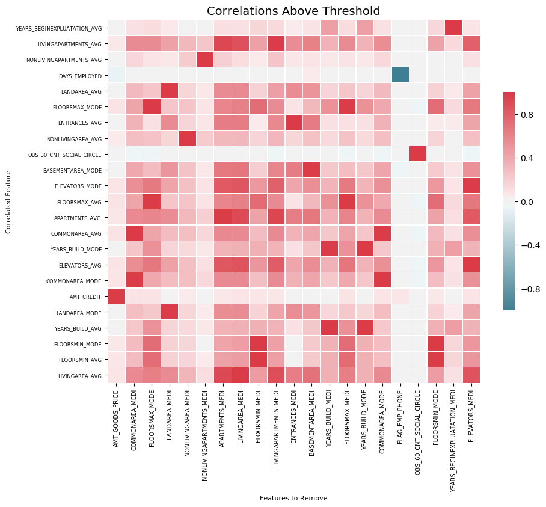
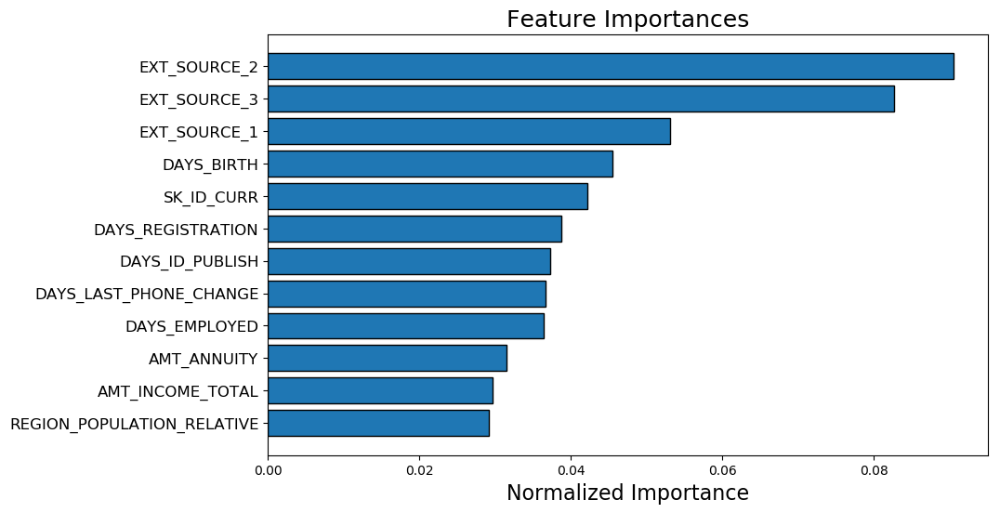

# Feature Selector: Simple Feature Selection in Python

Feature selector is a tool for dimensionality reduction of machine learning datasets.

# Methods

There are five methods used to identify features to remove:

1. Missing Values
2. Single Unique Values
3. Collinear Features
4. Zero Importance Features
5. Low Importance Features 

## Usage

Refer to the [Feature Selector Usage notebook](https://github.com/NageswarJetti/DS/blob/master/feature-selector-master/Feature%20Selector%20Usage.ipynb) for how to use

## Visualizations

The `FeatureSelector` also includes a number of visualization methods to inspect 
characteristics of a dataset. 

__Correlation Heatmap__



__Most Important Features__



Requires:

```
python==3.6+
lightgbm==2.1.1
matplotlib==2.1.2
seaborn==0.8.1
numpy==1.14.5
pandas==0.23.1
scikit-learn==0.19.1

```

